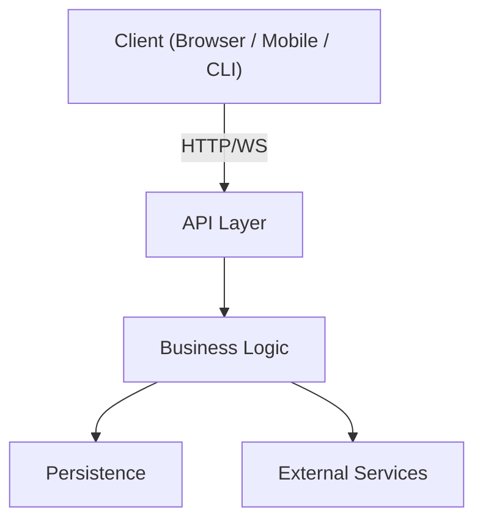
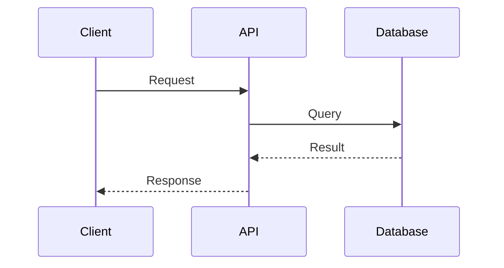
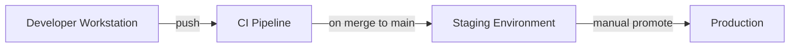

# Architecture

<!-- TEMPLATE: Replace all placeholder sections below with project-specific content.
     Lines marked [PLACEHOLDER] are required. Lines marked [OPTIONAL] can be removed if not applicable. -->

## System Overview

<!-- [PLACEHOLDER] 2-4 sentence description of what this system does, who its users are,
     and the primary problem it solves. -->

> This is a template. Replace this block with a concise description of the system.

## Component Diagram

<!-- [PLACEHOLDER] Replace this diagram with your actual component topology.
     Use Mermaid. No ASCII art. Keep it at the logical level -- no deployment details here. -->

## Data Flow

<!-- [PLACEHOLDER] Describe the primary data flows through the system.
     One sub-section per major flow is fine. -->

### [Flow Name, e.g., "User Authentication"]

<!-- [PLACEHOLDER] Step-by-step description of how data moves for this flow. -->

## Tech Stack

<!-- [PLACEHOLDER] List the technologies in use by layer. -->

| Layer | Technology | Notes |
|-------|-----------|-------|
| [Frontend] | [e.g., React, Livewire] | [PLACEHOLDER] |
| [API] | [e.g., Laravel, FastAPI] | [PLACEHOLDER] |
| [Database] | [e.g., PostgreSQL, SQLite] | [PLACEHOLDER] |
| [Cache] | [e.g., Redis, Memcached] | [OPTIONAL] |
| [Queue] | [e.g., Horizon, Celery] | [OPTIONAL] |
| [Infra] | [e.g., Kubernetes, Fly.io] | [OPTIONAL] |

## Deployment

<!-- [PLACEHOLDER] Describe how the system is deployed. Reference runbooks in docs/runbooks/ for operational detail. -->

### Environments

<!-- [PLACEHOLDER] Fill in URLs, regions, and any environment-specific notes. -->

| Environment | URL | Notes |
|-------------|-----|-------|
| Development | `http://localhost:[PORT]` | [PLACEHOLDER] |
| Staging | [PLACEHOLDER] | [OPTIONAL] |
| Production | [PLACEHOLDER] | [PLACEHOLDER] |

## Key Design Decisions

<!-- [OPTIONAL] Link to ADRs in docs/decisions/ for the most impactful choices. -->

See `docs/decisions/` for Architecture Decision Records. Notable decisions:

- [PLACEHOLDER: link to first real ADR once created]

## Constraints and Non-Goals

<!-- [OPTIONAL] What does this system explicitly NOT do? What hard constraints apply? -->

- [PLACEHOLDER: list any explicit non-goals or hard constraints]
