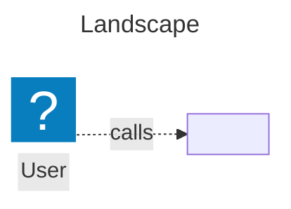

# Architecture

The architecture of <project> is modelled as code with [LikeC4](https://likec4.dev). Sources live beside this file (`spec.c4`, `model.c4`, `views.c4`); the LikeC4 workspace is the repo root and this directory is the project (`likec4.config.json`).

## Landscape

The block below is generated from `views.c4` by `mise run arch:gen` -- do not edit it by hand. It is a Mermaid approximation (no icons, colors, or nested styling); `mise run arch:dev` shows the real thing.

<!-- arch:index:start -->

<!-- arch:index:end -->

Every view is also exported to `generated/<view>.mmd`.

## Workflow

- **Change the model with the code.** A new service, datastore, or relationship is not done until it is in `model.c4` in the same commit.
- **Regenerate and commit:** `mise run arch:gen`, then commit `generated/` and this README together with the change. `mise run check` fails when they are stale.
- **Validate and format:** `mise run arch:validate`, `mise run arch:fmt`.
- **Browse:** `mise run arch:dev` (live reload at http://localhost:5173). The VS Code extension `likec4.likec4-vscode` (recommended in `.vscode/extensions.json`) gives inline validation, previews, and safe renames.
- **Share:** `pnpm dlx --config.enable-global-virtual-store=false -y likec4@$LIKEC4_VERSION build -o docs/architecture/dist --base ./` for a relocatable static site (`--output-single-file` for one HTML file), `... export png -o /tmp/arch` for images (needs Playwright), `... export drawio --uncompressed` for draw.io.

## Later

- **Deployment topology:** when this project has real infrastructure, add `deployment.c4` (see the LikeC4 deployment model docs).
- **Published site:** the LikeC4 docs include a GitHub Pages workflow; copy it into `.github/workflows/` when there is somewhere to publish to.
- **Model rules** (every component has a `technology`, no `#deprecated` element has inbound relationships, ...): the docs' Vitest + LikeC4 API recipe, once the project has a Node test runner. Wire it in as a `check.sh` step.
